# LAB-21-Default-Routing
tanggal 15 agustus 2025
# Default Routing

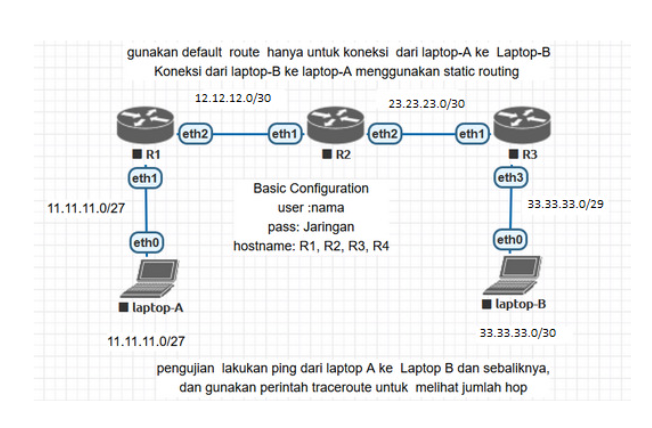

**langkah-langkah:**
# R1
1. colokkan R1 ke laptop buka winbox     
   pilih menu terminal buatkan password dan user lalu identity      

via terminall: 

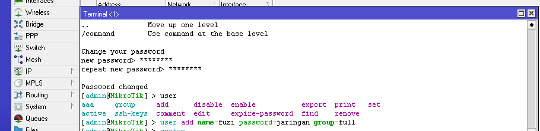

pilih menu system > identity **R1**   

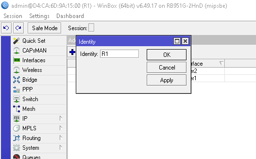

2. masukan ip address untuk eth1 dan eth2    
   pilih Menu IP > Address  
   klik +  

eth1  
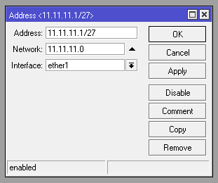 

eth2  
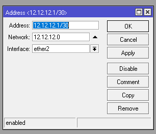 

apply lalu ok  

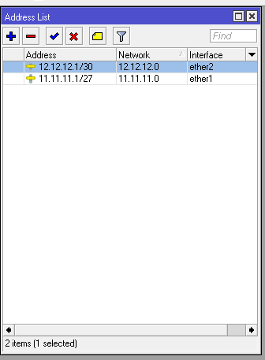

3. konfigurasi static routing  
   pilih menu IP > routes      
   dst-addres= ip default (0.0.0.0/0)   
   gateway= ip yang akan di pasang di router2

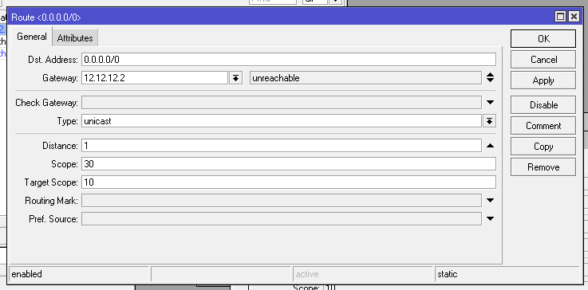

apply lalu ok

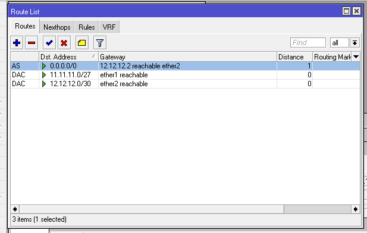

# R2  
  1. Buat username dan password sesuai perintah di Topologi.  
     USN : ahnaf  
     PASS: Jaringan 
     
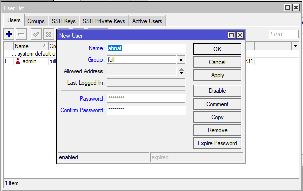  

  2. Login mengunakan user yang telah dibuat.
      
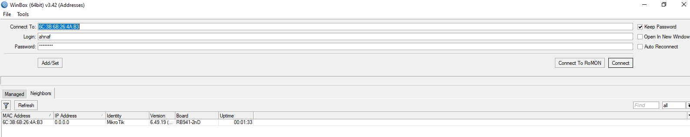  

  3. Ganti Identitas RB menjadi **R2**.    
     via terminal:    

         system identity set name=R2
     
  4. Tambahkan IP Address untuk ether1 dan ether2.  
     ether1 = 12.12.12.2/30 (untuk koneksi R2 ke R1)  
     ether2 = 23.23.23.1/30 (untuk koneksi R2 ke R3)

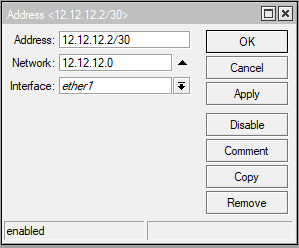

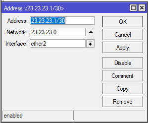

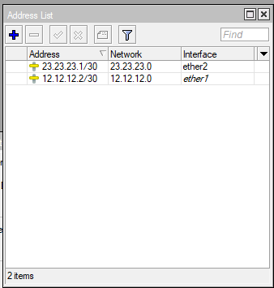 

  5. Sekarang konfigurasi static routing  
     dst addrs=11.11.11.0/27 gateway=12.12.12.1  
     dst addrs=33.33.33.0/29 gateway=23.23.23.2

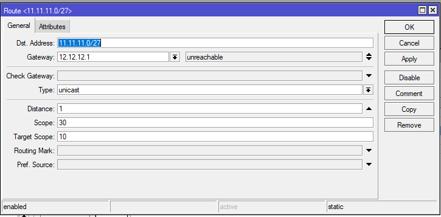

 

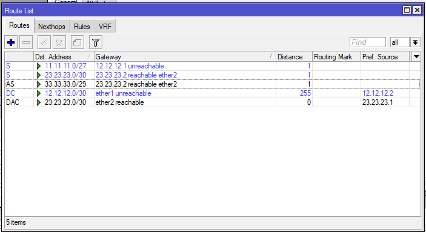  

# R3
  1. Buat username dan password sesuai perintah di Topologi.  
     via terminal: 

         user add name=ahnaf password=jaringan group=full
       
  2. Login mengunakan user yang telah dibuat.  
  3. Ganti Identitas RB menjadi **R3**.  
     via terminal:  

          system identity set name=R3
     
  4. Tambahkan IP Address untuk ether1 dan ether2.  
     ether1 = 23.23.23.2/30 (untuk koneksi R3 ke R2)  
     ether2 = 33.33.33.1/29 (untuk koneksi R3 ke Laptop B)  
     via terminal:

          
          ip address add interface=ether1 address=23.23.23.2/30  
          ip address add interface=ether2 address=33.33.33.1/29
     
  5. Sekarang konfigurasi static routing  
     dst addrs=11.11.11.0/27 gateway=23.23.23.1   
     via terminal:

          ip route add dst-address=11.11.11.0/27 gateway=23.23.23.1

# setting ip Laptop  
  Jika semua router sudah di konfigurasi, selanjutnya kita setting IP untuk setiap laptop.  
  Laptop A = 11.11.11.2  
  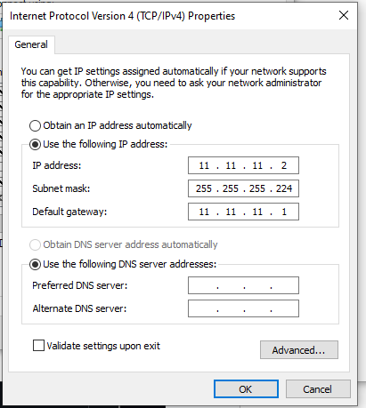  
  Laptop B = 33.33.33.3  
  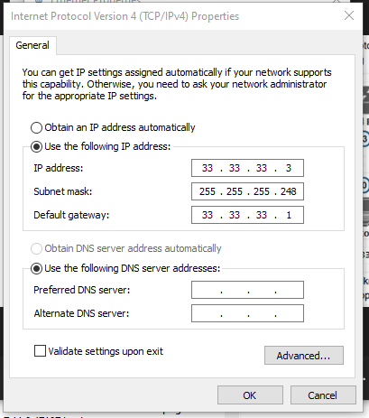  
# pengujian via cmd
  Jika sudah coba ping dari Laptop A ke B dan sebaliknya, apakah sudah terkoneksi.  
  Laptop A:  
  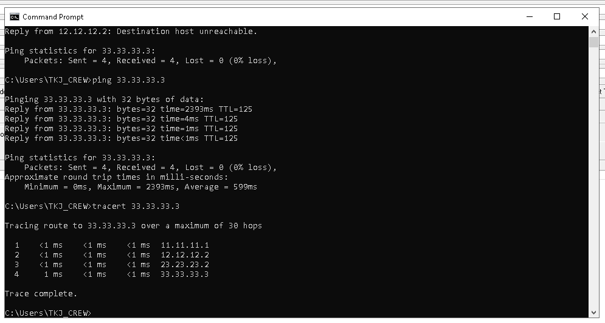  
  Laptop B:  
  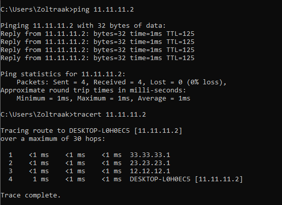

# kesimpulan
Default route ini menggunakan network 0.0.0.0 sebagai destinasinya. Network 0.0.0.0 itu bisa mencakup semua network yang memang benar-benar tidak ada di table routing, misalnya internet.

