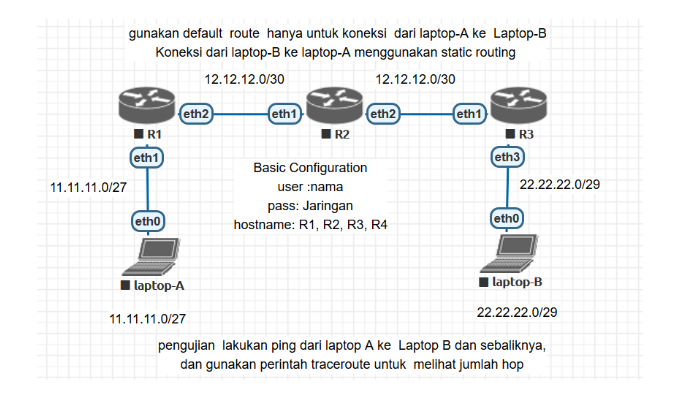
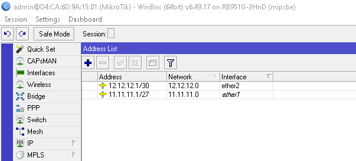
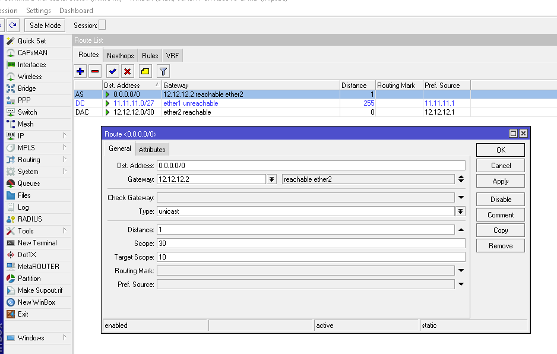
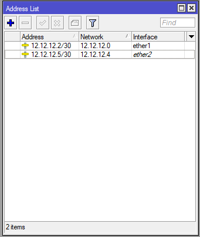
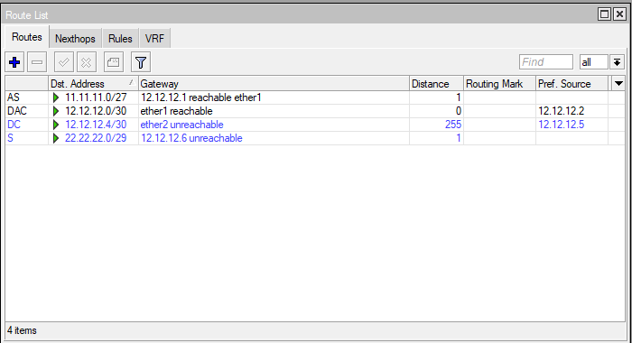
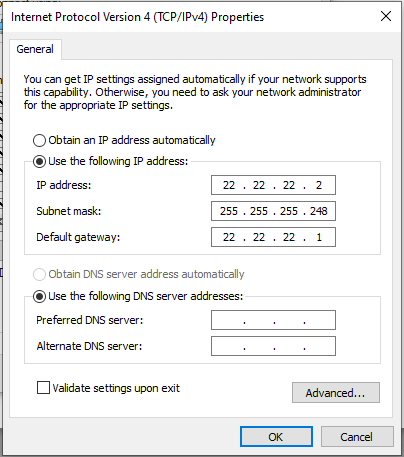
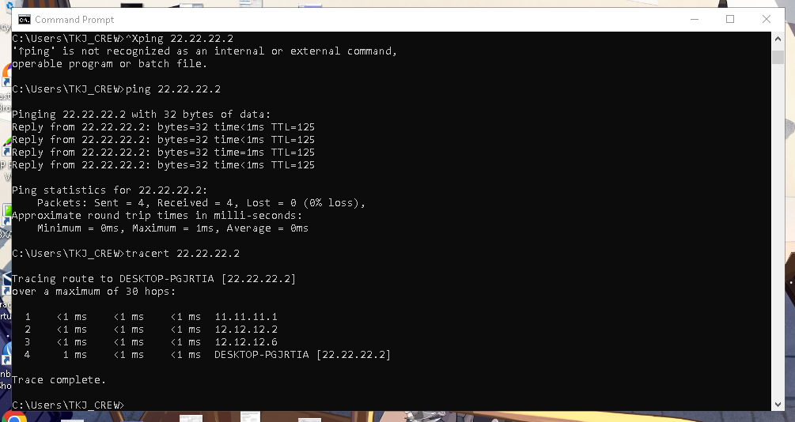
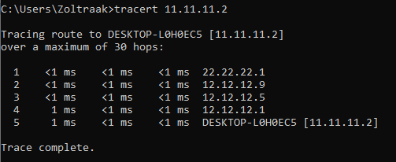

# LAB-21-Default-Routing
tanggal 15 agustus 2025
# Default Routing

**langkah-langkah:**
# R1
1. colokkan R1 ke laptop buka winbox     
   pilih menu terminal buatkan password dan user lalu identity    

2. masukan ip address untuk eth1 dan eth2    
   pilih Menu IP > Address  
   klik +  

 

3. konfigurasi static routing 
   pilih menu IP > routes    
   dst-addres= ip default (0.0.0.0/0)   
   gateway= ip yang akan di pasang di router2

# R2  
  1. Buat username dan password sesuai perintah di Topologi.  
     USN : ahnaf  
     PASS: Jaringan  
  
  2. Login mengunakan user yang telah dibuat.  
  
  3. Ganti Identitas RB menjadi **R2**.  

         system identity set name=R2
  4. Tambahkan IP Address untuk ether1 dan ether2.  
     ether1 = 12.12.12.2/30 (untuk koneksi R2 ke R1)  
     ether2 = 12.12.12.5/30 (untuk koneksi R2 ke R3)  
  
  5. Sekarang konfigurasi static routing  
     dst addrs=11.11.11.0/27 gateway=12.12.12.1  
     dst addrs=22.22.22.0/29 gateway=12.12.12.6  
  

# R3
  1. Buat username dan password sesuai perintah di Topologi.  

         user add name=ahnaf password=jaringan group=full  
  2. Login mengunakan user yang telah dibuat.  
  
  3. Ganti Identitas RB menjadi **R4**.  

          system identity set name=R3  
  4. Tambahkan IP Address untuk ether1 dan ether2.  
     ether1 = 12.12.12.6/30 (untuk koneksi R3 ke R2)  
     ether2 = 22.22.22.1/29 (untuk koneksi R3 ke Laptop B)

          
          ip address add interface=ether1 address=12.12.12.6/30  
          ip address add interface=ether2 address=22.22.22.1/29
  5. Sekarang konfigurasi static routing  
     dst addrs=11.11.11.0/27 gateway=12.12.12.5

          ip route add dst-address=11.11.11.0/27 gateway=12.12.12.5

# setting ip Laptop  
  Jika semua router sudah di konfigurasi, selanjutnya kita setting IP untuk setiap laptop.  
  Laptop A = 11.11.11.2  
    
  Laptop B = 22.22.22.2  
    
# pengujian via cmd
  Jika sudah coba ping dari Laptop A ke B dan sebaliknya, apakah sudah terkoneksi.  
  Laptop A:  
    
  Laptop B:  
    

