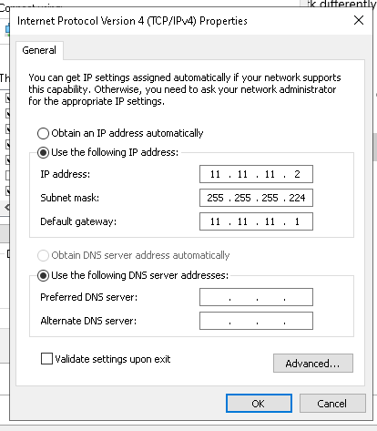

# LAB-21-Default-Routing
tanggal 15 agustus 2025
# Default Routing

**langkah-langkah:**
# R1
1. colokkan R1 ke laptop buka winbox     
   pilih menu terminal buatkan password dan user lalu identity    

2. masukan ip address untuk eth1 dan eth2    
   pilih Menu IP > Address  
   klik +  

 

3. konfigurasi static routing 
   pilih menu IP > routes    
   dst-addres= ip default (0.0.0.0/0)   
   gateway= ip yang akan di pasang di router2  

setting ip pc

prngujian 

